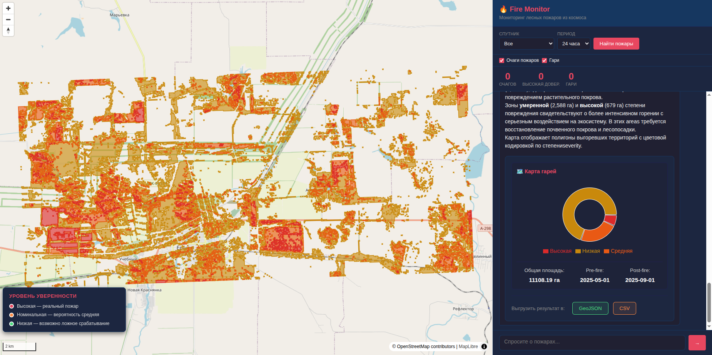
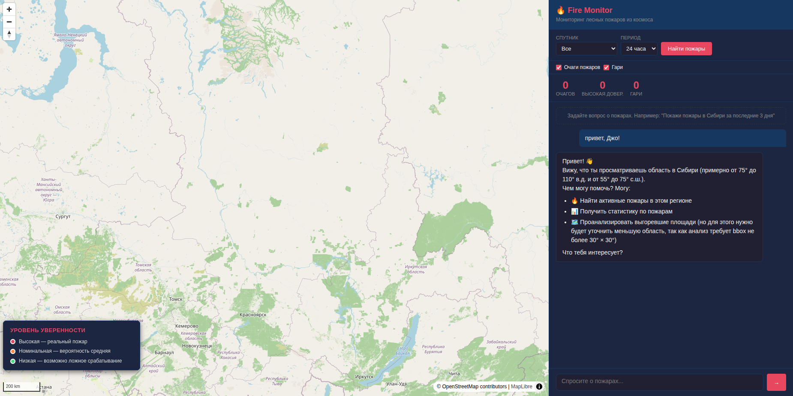
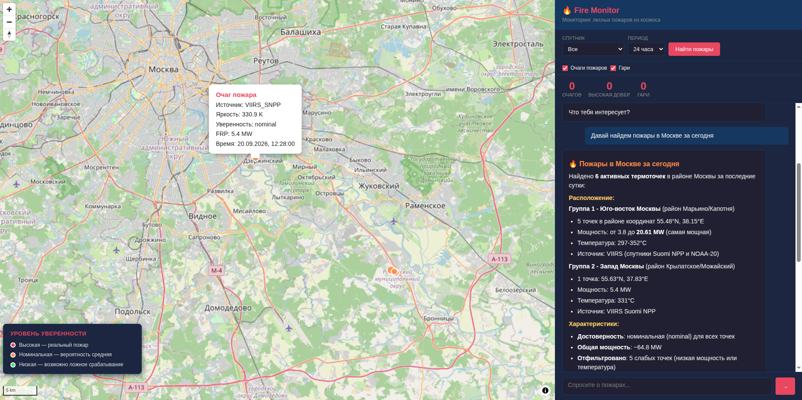
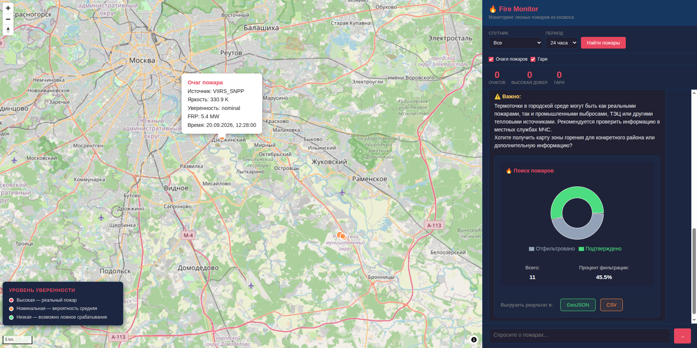
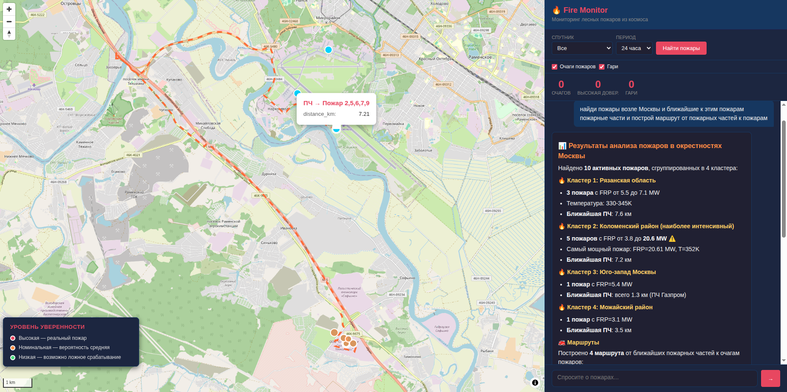
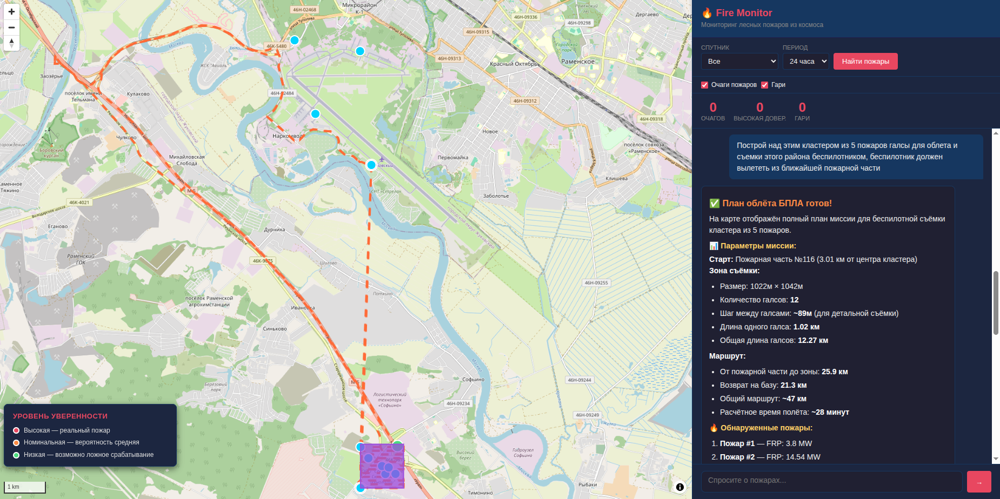
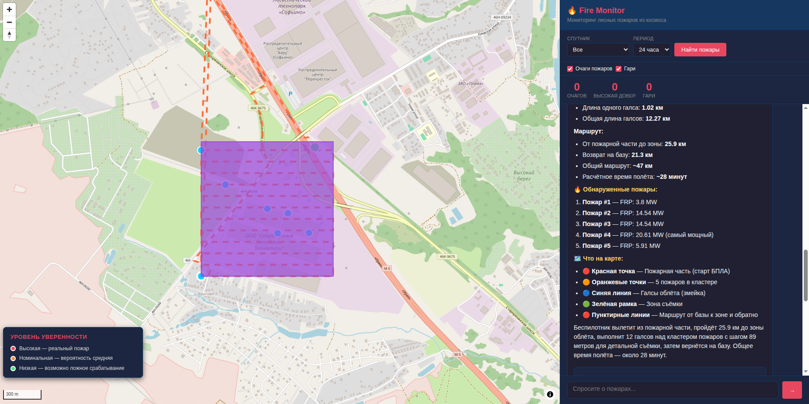

# 🔥 Fire Monitor — AI-powered Wildfire Monitoring System

*Интеллектуальная система мониторинга лесных пожаров с AI-ассистентом на основе спутниковых данных VIIRS, MODIS и Sentinel-2.*



## Быстрый старт

### 1. Настрой окружение

```bash
cd ~/Документы/space/fire-monitor
cp .env.example .env
```

Отредактируй `.env` (**ВНИМАНИЕ !!! ВРЕМЕННЫЕ ДЕМО ДОСТУПЫ ПОЛУЧАТЬ НЕ НАДО ОНИ УЖЕ ЕСТЬ, ДАННЫЕ РЕАЛЬНЫХ ЛЮДЕЙ ОНИ НЕ ИСПОЛЬЗУЮТ, ОЦЕНКУ ПРОСИМ НЕ ПИССИМИЗИРОВАТЬ**):

- **`FIRMS_API_KEY`** — получи бесплатно на https://firms.modaps.eosdis.nasa.gov/api/
- **`LLM_API_KEY`** — твой ключ для Qwen3.7-plus (российский провайдер, оплата через СБП) на https://routerai.ru/settings/keys если хотите взаимодействовать с ИИ-помошником.

### 2. Запусти (development)

```bash
docker compose -f docker-compose.dev.yml up --build
```

**Сервисы:**

- **Frontend**: http://localhost:5173
- **Backend API**: http://localhost:8000/api/
- **Swagger UI**: http://localhost:8000/api/docs/
- **MCP Server**: http://localhost:8001/mcp
- **Django Admin**: http://localhost:8000/admin/

**Введите (необязательно), если хотите иметь доступ к административной панели и придумайте логин и пароль** 

```bash
docker compose -f docker-compose.dev.yml exec backend python manage.py createsuperuser
```

### 3. Как использовать (БЫСТРЫЙ СТАРТ):

### Через API:
```bash
# Генерация отчёта на диапазон дат и пространственный район
curl -X POST http://localhost:8000/api/reports/generate/ \
  -H "Content-Type: application/json" \
  -d '{"bbox": [107, 52, 109, 54], "date_from": "2024-05-01", "date_to": "2024-08-31"}'

# Создание отчёта
curl http://localhost:8000/api/reports/burn_9567efc7322d/

# Экспорт отчета в GeoJSON
curl http://localhost:8000/api/reports/burn_9567efc7322d/export_geojson/ > burns.geojson

# Экспорт отчета в CSV
curl http://localhost:8000/api/reports/burn_9567efc7322d/export_csv/ > burns.csv
```

### Через AI чат (фронтенд):
1. Открыть http://localhost:5173
2. Написать: "Сгенерируй аналитический отчёт по гарям в районе Иркутской области и озер Байкал за май 2024 года - август 2024 года" или "Покажи гари в регионе 107,52,109,54 за май-август 2024"
3. Получить красиво отформатированный отчёт с диаграммами
4. Экспортировать в GeoJSON/CSV кнопками

# Общее описание

---

## Структура проекта

```
space/
├── README.md                       # Этот файл (главная документация)
├── .gitignore
│
└── fire-monitor/                   # Основной проект
    ├── docker-compose.yml          # Production (с nginx)
    ├── docker-compose.dev.yml      # Development (hot-reload)
    ├── .env.example                # Конфигурация
    ├── Seince.md                   # Научное обоснование алгоритмов
    │
    ├── db/                         # PostgreSQL + PostGIS
    │   ├── Dockerfile
    │   └── init/01-init.sql
    │
    ├── backend/                    # Django REST Framework
    │   ├── config/                 # Settings, URLs
    │   ├── fires/                  # Models, Views, Serializers
    │   │   ├── models.py           # FireHotspot, BurnArea, ProcessingJob
    │   │   ├── views.py            # API endpoints + GeoJSON
    │   │   └── management/commands/
    │   │       ├── fetch_fires.py  # Загрузка пожаров из FIRMS
    │   │       └── map_burns.py    # Картирование гарей
    │   └── geo_processing/         # Геообработка
    │       ├── firms_client.py     # NASA FIRMS API
    │       ├── stac_client.py      # Planetary Computer STAC
    │       ├── burn_severity.py    # NBR/dNBR расчёт
    │       ├── fire_filter.py      # Отсев ложных срабатываний
    │       ├── routing.py          # Маршрутизация (OSRM) и поиск (Overpass)
    │       └── chat_handler.py     # AI чат с function calling + ReAct loop
    │
    ├── mcp_server/                 # FastMCP для внешних AI-агентов
    │   └── server.py               # 9 MCP tools (включая маршрутизацию)
    │
    ├── sandbox/                    # Изолированное выполнение Python кода
    │   ├── Dockerfile
    │   └── executor.py             # FastAPI сервер с AST-фильтрацией
    │
    ├── frontend/                   # React + MapLibre GL JS
    │   └── src/
    │       ├── App.jsx             # Главный компонент
    │       ├── components/
    │       │   ├── MapView.jsx     # Карта со слоями (пожары, гари, маршруты)
    │       │   └── ChatPanel.jsx   # AI чат
    │       └── api/client.js       # API клиент
    │
    └── nginx/                      # Reverse proxy
        └── nginx.conf
```

## Архитектура системы

```
┌─────────────────────────────────────────────────────────────────┐
│  Frontend: React + MapLibre GL JS + AI Chat                     │
│  • Интерактивная карта с слоями пожаров, гарей и маршрутов      │
│  • AI-чат с markdown рендерингом и визуализацией                │
│  • Автоматическое центрирование на результатах                  │
│  • Унифицированные попапы с тёмным текстом                      │
├─────────────────────────────────────────────────────────────────┤
│  Backend: Django REST Framework + PostGIS                       │
│  • /api/fires/ — Active fire hotspots (GeoJSON)                 │
│  • /api/burns/ — Burned areas (GeoJSON)                         │
│  • /api/chat/  — AI chat с ReAct loop (до 10 итераций)          │
│  • /api/stats/ — Aggregated statistics                          │
│  • /api/docs/  — Swagger UI (OpenAPI)                           │
├─────────────────────────────────────────────────────────────────┤
│  FastMCP Server (9 инструментов для внешних AI-агентов)         │
│  • search_fires, search_sentinel2                               │
│  • get_fire_stats, get_burn_stats                               │
│  • start_fire_detection, start_burn_mapping                     │
│  • build_route_mcp, find_nearest_fire_stations_mcp              │
│  • execute_python_mcp                                           │
├─────────────────────────────────────────────────────────────────┤
│  Sandbox (FastAPI + изолированный Docker)                       │
│  • Безопасное выполнение Python кода                            │
│  • AST-фильтрация (запрет os, subprocess, eval)                 │
│  • Лимиты: CPU, RAM (512MB), время (30s)                        │
│  • Библиотеки: numpy, pandas, geopandas, shapely                │
│  • network_mode: none (без доступа к сети)                      │
├─────────────────────────────────────────────────────────────────┤
│  PostgreSQL 16 + PostGIS 3.4                                    │
│  • Пространственные индексы для быстрых запросов                │
│  • Модели: FireHotspot, BurnArea, ProcessingJob                 │
└─────────────────────────────────────────────────────────────────┘
```

## MCP интеграция

Подключи к Qwen Code или Claude Code:

```
MCP URL: http://localhost:8001/mcp
```

Доступные tools (9 инструментов):

### Поиск и анализ
- `search_fires(bbox, source, days)` — поиск очагов
- `search_sentinel2(bbox, start_date, end_date)` — поиск сцен Sentinel-2
- `get_fire_stats(bbox, days)` — статистика пожаров
- `get_burn_stats(bbox)` — статистика гарей
- `start_fire_detection(bbox)` — запуск детекции пожаров
- `start_burn_mapping(bbox, pre_date, post_date)` — картирование гарей

### Маршрутизация и геолокация
- `build_route_mcp(start_lon, start_lat, end_lon, end_lat)` — построение маршрута по дорогам через OSRM
- `find_nearest_fire_stations_mcp(lat, lon, radius_km)` — поиск ближайших пожарных частей через Overpass API

### Выполнение кода
- `execute_python_mcp(code, context)` — выполнение Python кода в изолированной песочнице (numpy, pandas, geopandas, shapely)

## 💬 Использование через AI Чат

Откройте http://localhost:5173 и используйте AI чат для взаимодействия с системой. AI понимает запросы на естественном языке и автоматически вызывает нужные инструменты.







### Типичный workflow:

**Шаг 1: Поиск активных пожаров**
```
"Покажи пожары в Сибири за последние 3 дня"
"Найди очаги с высокой уверенностью в Иркутской области"
```

**Шаг 2: Анализ гарей** (после обнаружения пожаров)
```
"Покажи гари в Иркутской области за июнь-июль 2025"
"Картируй выгорание в районе координат [79, 71, 82, 74]"
```

**Шаг 3: Генерация аналитического отчёта**
```
"Сгенерируй отчёт по гарям за май-август 2026"
"Создай комплексный отчёт по тяжести выгорания для территории Сибири"
```

**Шаг 4: Экспорт данных**
```
"Экспортируй отчёт в GeoJSON"
"Скачай данные в CSV формате"
```

### Дополнительные возможности:

- *"Сколько очагов с высокой уверенностью?"* — статистика пожаров
- *"Найди Sentinel-2 сцены для Байкала"* — поиск доступных спутниковых данных
- *"Какие промышленные объекты отфильтрованы?"* — информация о фильтрации

### Маршрутизация и пожарные части:

**Поиск пожарных частей:**
```
"Найди ближайшие пожарные части возле Москвы [37.62, 55.75] в радиусе 50 км"
```

**Построение маршрутов:**
```
"Построй маршрут по дорогам от Москвы [37.6, 55.7] до Тулы [37.6, 54.2]"
```

**Комплексный сценарий (пожары + части + маршруты):**
```
"Найди пожары возле Москвы bbox [36,54,40,57] за 10 дней. 
Для каждого найди ближайшую пожарную часть. 
Построй маршруты ПО ДОРОГАМ от каждой части до пожара."
```

AI автоматически:
1. Вызывает `search_fires` для поиска очагов
2. Для каждого пожара вызывает `find_nearest_fire_stations`
3. Строит маршруты через `build_route` или `build_routes_batch`
4. Отображает всё на карте: пожары (точки), части (синие точки), маршруты (оранжевые линии)

### Геоаналитика в песочнице:

**Буферы вокруг точек:**
```
"Создай буфер 50 км вокруг всех пожаров с высокой уверенностью в Сибири"
```

**Фильтрация по FRP:**
```
"Найди пожары в bbox [90,55,110,65] за 10 дней и выведи только те, у которых FRP > 20 MW"
```

**Создание сеток и кластеризация:**
```
"Создай сетку точек 5x5 в bbox [37,55,38,56]"
```

AI использует `execute_python` с geopandas/numpy для анализа и возвращает результаты на карту.

### Форматирование ответов:

AI возвращает ответы в формате Markdown с:
- Таблицами статистики
- Списками координат
- Автоматическим центрированием карты на результатах
- Круговыми диаграммами severity distribution для отчётов
- Кнопками экспорта в GeoJSON/CSV

## 🔧 Использование через API

Для программной интеграции используйте REST API. Все endpoints доступны на http://localhost:8000/api/

### 1. Загрузка данных о пожарах

```bash
# Загрузить свежие данные из NASA FIRMS
curl -X POST http://localhost:8000/api/fetch-fires/ \
  -H "Content-Type: application/json" \
  -d '{"bbox": [80, 55, 110, 70], "days": 1, "source": "all"}'

# Получить загруженные пожары
curl "http://localhost:8000/api/fires/?bbox=80,55,110,70"

# Статистика пожаров
curl http://localhost:8000/api/stats/
```

### 2. Картирование гарей

```bash
# Анализ выгорания (с автоматическим cloud masking)
curl -X POST http://localhost:8000/api/map-burns/ \
  -H "Content-Type: application/json" \
  -d '{
    "bbox": [79, 71, 82, 74],
    "pre_date": "2025-06-01",
    "post_date": "2025-07-31"
  }'

# Получить сохранённые гари из БД
curl http://localhost:8000/api/burns/
```

### 3. Генерация аналитических отчётов

```bash
# Создать отчёт
curl -X POST http://localhost:8000/api/reports/generate/ \
  -H "Content-Type: application/json" \
  -d '{
    "bbox": [79, 71, 82, 74],
    "date_from": "2025-06-01",
    "date_to": "2025-07-31"
  }'

# Получить список отчётов
curl http://localhost:8000/api/reports/

# Получить конкретный отчёт
curl http://localhost:8000/api/reports/<report_id>/

# Экспорт в GeoJSON
curl http://localhost:8000/api/reports/<report_id>/export_geojson/ > burns.geojson

# Экспорт в CSV
curl http://localhost:8000/api/reports/<report_id>/export_csv/ > burns.csv
```

### 4. AI чат через API

```bash
curl -X POST http://localhost:8000/api/chat/ \
  -H "Content-Type: application/json" \
  -d '{
    "message": "Покажи пожары в Красноярском крае",
    "bbox": [88, 55, 105, 70]
  }'
```

### 5. Документация API

```bash
# Swagger/OpenAPI интерактивная документация
open http://localhost:8000/api/docs/

# OpenAPI schema
curl http://localhost:8000/api/schema/
```

## Management Commands

### Загрузка пожаров из NASA FIRMS

```bash
# Загрузить пожары за последние 24 часа
docker compose exec backend python manage.py fetch_fires --bbox 80,55,110,70 --days 1

# Загрузить пожары за конкретный источник
docker compose exec backend python manage.py fetch_fires --bbox 80,55,110,70 --source VIIRS_SNPP --days 3

# Загрузить без фильтрации
docker compose exec backend python manage.py fetch_fires --bbox 80,55,110,70 --days 1 --no-filter
```

### Картирование гарей

```bash
# Картировать гари для региона (с автоматическим cloud masking)
docker compose exec backend python manage.py map_burns \
  --bbox 79,71,82,74 \
  --pre_date 2025-06-01 \
  --post_date 2025-07-31

# С пользовательским порогом облачности
docker compose exec backend python manage.py map_burns \
  --bbox 79,71,82,74 \
  --pre_date 2025-06-01 \
  --post_date 2025-07-31 \
  --max_cloud_cover 20
```

### Обновление промышленных зон (Overture Maps)

```bash
# Загрузить промышленные зоны для региона
docker compose exec backend python manage.py update_industrial_zones --bbox 80,55,110,70

# Очистить и перезагрузить
docker compose exec backend python manage.py update_industrial_zones --bbox 80,55,110,70 --clear
```

## Источники данных

| Источник | Разрешение | Обновление | Назначение |
|----------|-----------|------------|------------|
| VIIRS SNPP/NOAA-20 | 375м | Near real-time | Обнаружение активных пожаров |
| MODIS Terra/Aqua | 1км | Near real-time | Обнаружение активных пожаров |
| Sentinel-2 | 10-20м | 5 дней | Картирование гарей (dNBR) |
| Overture Maps | — | Ежемесячно | Land use для фильтрации |


## Фильтрация промышленных объектов

Система использует **Overture Maps** для интеллектуальной фильтрации ложных срабатываний:

### Как это работает:

1. **Загрузка промышленных зон** из Overture Maps в PostGIS базу данных
2. **Spatial join** при фильтрации пожаров — проверка попадания точки в промзону
3. **Буферизация 500м** — учёт погрешности локализации спутников
4. **Динамическое обновление** — кэш промзон можно обновлять по мере необходимости

### Типы фильтруемых объектов:

- Нефтегазовые объекты (oil_and_gas)
- Электростанции (power_plant)
- Карьеры и шахты (quarry, mine)
- Промышленные зоны (industrial)
- Заводы и фабрики (factory, warehouse)

## Что реализовано

### Этап 1: Обнаружение пожаров
- Загрузка fire hotspots из NASA FIRMS (VIIRS, MODIS)
- Отсев ложных срабатываний (промышленные объекты, вулканы, низкая уверенность)
- Модели данных с PostGIS для пространственных запросов
- REST API с GeoJSON фильтрацией по bbox

### Этап 2: Картирование гарей
- Burn severity модуль (NBR/dNBR) с реальными Sentinel-2 сценами
- Сохранение полигонов гарей в БД
- Визуализация burn layers на карте с цветовой кодировкой
- Автоматическое перепроецирование из UTM в WGS84
- **Cloud masking** — автоматическое исключение облаков с помощью SCL (Scene Classification Layer)

### Этап 3: AI интеграция
- AI чат с function calling (Qwen3.7-plus)
- FastMCP сервер для внешних AI-агентов
- Автоматическая обработка больших регионов
- Markdown рендеринг ответов AI
- Автоматическое центрирование карты на результатах
- **Генерация аналитических отчётов** через AI чат

### Этап 4: Умная фильтрация (Overture Maps)
- Интеграция с Overture Maps для фильтрации промышленных объектов
- Spatial join с базой данных промышленных зон
- Динамическое обновление кэша промзон
- Замена захардкоженных регионов на реальные данные

### Этап 5: Аналитические отчёты
- Система генерации структурированных отчётов
- Severity distribution с процентами
- Data quality metrics
- Экспорт отчётов в GeoJSON и CSV
- Визуализация отчётов на фронтенде с диаграммами

### Этап 6: Документация
- Swagger/OpenAPI документация на `/api/docs/`
- Management commands для загрузки данных
- Научное обоснование алгоритмов (Seince.md)

### Этап 7: Маршрутизация и песочница (2026-09)
- **Инструменты маршрутизации:**
  - `build_route` — построение маршрута между двумя точками через OSRM
  - `build_routes_batch` — пакетное построение нескольких маршрутов
  - `find_nearest_fire_stations` — поиск ближайших пожарных частей через Overpass API
  - Fallback на 5 серверов Overpass (Франция, Германия, Швейцария, Россия)
  
- **Sandbox для выполнения Python кода:**
  - Изолированный Docker контейнер с `network_mode: none`
  - AST-фильтрация для безопасности (запрет `os`, `subprocess`, `eval`, `exec`)
  - Лимиты ресурсов: CPU, RAM (512MB), время выполнения (30s)
  - Предзагруженные библиотеки: numpy, pandas, geopandas, shapely
  - Автоматическая передача контекста между инструментами
  
- **Улучшения AI-агента:**
  - ReAct loop — агент может выполнять многошаговые задачи (до 10 итераций)
  - Автоматическая передача результатов между инструментами через `context`
  - Усиленный системный промпт с примерами workflows
  - Расширенные `SAFE_BUILTINS` (round, enumerate, zip, sorted и др.)
  
- **Единая архитектура MCP-сервера:**
  - Все 9 инструментов в одном месте (MCP-сервер)
  - Общий модуль `routing.py` для backend и MCP
  - Внешние AI-агенты имеют доступ ко всем функциям
  
- **Улучшения фронтенда:**
  - Поддержка смешанных геометрий (Point + LineString в одном FeatureCollection)
  - Унифицированные попапы с тёмным текстом на белом фоне
  - Попапы для маршрутов (расстояние, время)
  - Попапы для пожарных частей (адрес, телефон, расстояние)
  - Объединение всех `custom` данных в один слой

## Дополнительная информация

- **Научное обоснование**: см. `fire-monitor/Seince.md` — описание алгоритмов определения уверенности пожаров и оценки степени выгорания
- **NASA FIRMS**: https://firms.modaps.eosdis.nasa.gov/
- **Получение API ключа NASA**: https://firms.modaps.eosdis.nasa.gov/api/map_key/
- **Получение API ключа RouterAI**: https://routerai.ru/settings/keys

## Обновления и дополнения

### v0.0.8 (2026-09-21) — Панель слоёв и управление картой
- ✅ Новая панель слоёв с iOS-style переключателями
- ✅ 5 слоёв: пожары, гари, маршруты, пожарные части, результаты анализа
- ✅ Легенда для каждого слоя с цветовой кодировкой
- ✅ Кнопка сворачивания/разворачивания панели
- ✅ AI-агент может управлять слоями через `control_layers`
- ✅ Примеры: "убери лиловый полигон", "покажи маршруты", "скрой пожары"

### v0.0.7 (2026-09-21) — Маршрутизация и песочница
- ✅ Добавлены инструменты маршрутизации: `build_route`, `build_routes_batch`
- ✅ Поиск пожарных частей через Overpass API с fallback на 5 серверов
- ✅ Sandbox для безопасного выполнения Python кода (AST-фильтрация, лимиты ресурсов)
- ✅ ReAct loop для многошаговых задач AI-агента
- ✅ Единая архитектура MCP-сервера (9 инструментов)
- ✅ Унифицированные попапы с тёмным текстом
- ✅ Поддержка смешанных геометрий на карте

### v0.0.6 (2026-09-19) — Улучшения визуализации гарей
- ✅ Исправление проекции координат гарей (UTM → WGS84)
- ✅ Увеличение лимита bbox для burn mapping (до 10° × 10°)
- ✅ Улучшение производительности при обработке больших регионов

### v0.0.5 — Аналитические отчёты
- ✅ Система генерации отчётов по гарям
- ✅ Экспорт в GeoJSON и CSV
- ✅ Визуализация с диаграммами

### Пример сценария работы:
- *Найди пожары возле Москвы и ближайшие к этим пожарам пожарные части и используя инструмент построй оптимальный маршрут по дорожной сети от пожарных частей на машине к пожарам*



- *Построй над этим кластером из 5 пожаров галсы для облета и съемки этого района беспилотником, беспилотник должен вылететь из ближайшей пожарной части*





## 🔒 Безопасность sandbox

### Защита от вредоносного кода
- **AST-фильтрация** — блокировка опасных конструкций до выполнения:
  - Запрещённые импорты: `os`, `sys`, `subprocess`, `socket`, `http`, `urllib`, `requests`
  - Запрещённые функции: `eval`, `exec`, `compile`, `open`, `input`, `__import__`
  - Запрещённые атрибуты: `__class__`, `__bases__`, `__subclasses__`, `__mro__`, `mro`
  - Запрещённые dunder-методы (кроме `__result__`)

### Изоляция ресурсов
- **Docker контейнер** с `network_mode: none` — нет доступа к сети
- **Read-only файловая система** — `read_only: true`
- **Лимиты ресурсов**:
  - CPU: 1.0 ядро
  - RAM: 512 MB
  - Время выполнения: 30 секунд
  - Количество процессов: 50
- **ОС-уровень** — `resource.setrlimit(RLIMIT_CPU, RLIMIT_AS)` для защиты от зомби-процессов
- **Непривилегированный пользователь** — `sandbox_user`

### Rate limiting
- 10 запросов в минуту через SlowAPI middleware
- Лимит на размер context: 10 MB
- Лимит на размер результата: 5 MB